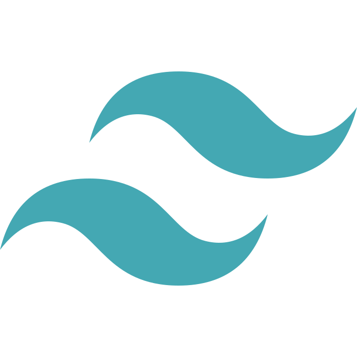
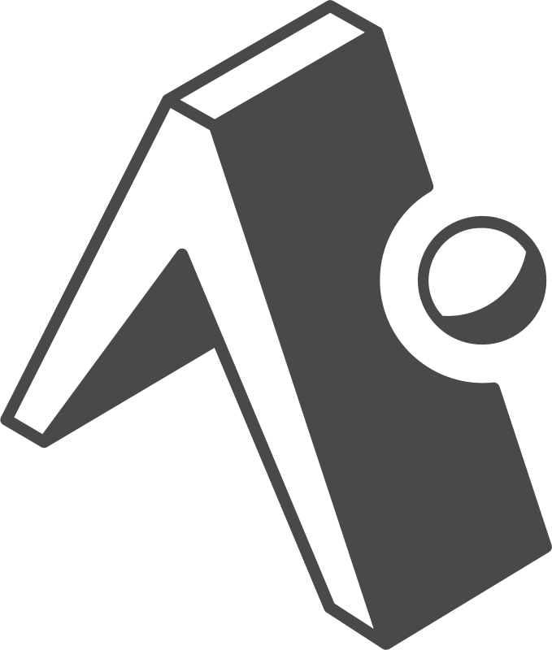
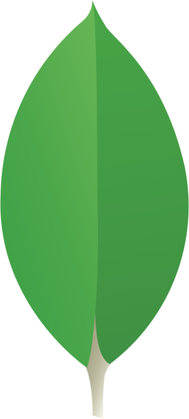
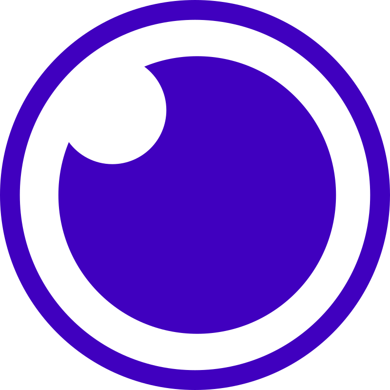
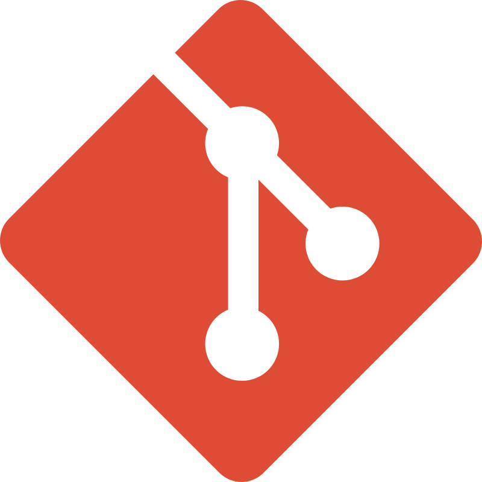
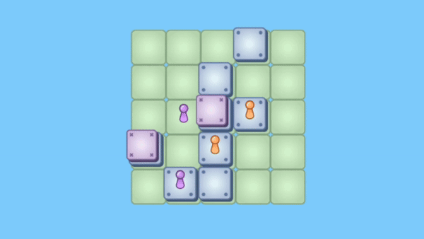

# 👦 About me

Hi! I’m a french fullstrack developer living in Geneva. I like to develop things on my free time.

More informations on my website: **[cjosse.com](https://www.cjosse.com/)**

 
 
 

# 📭 Contact

	
	&nbsp;
	
	&nbsp;
	

 
 
 

# 🛠️ Languages and Tools
## Design & Frontend

	&nbsp;&nbsp;&nbsp;&nbsp;
	&nbsp;&nbsp;&nbsp;&nbsp;
	&nbsp;&nbsp;&nbsp;&nbsp;
	&nbsp;&nbsp;&nbsp;&nbsp;
	&nbsp;&nbsp;&nbsp;&nbsp;
	&nbsp;&nbsp;&nbsp;&nbsp;

## Backend

	&nbsp;&nbsp;&nbsp;&nbsp;
	&nbsp;&nbsp;&nbsp;&nbsp;
	&nbsp;&nbsp;&nbsp;&nbsp;
	&nbsp;&nbsp;&nbsp;&nbsp;
	&nbsp;&nbsp;&nbsp;&nbsp;
	&nbsp;&nbsp;&nbsp;&nbsp;
	&nbsp;&nbsp;&nbsp;&nbsp;
	&nbsp;&nbsp;&nbsp;&nbsp;
	&nbsp;&nbsp;&nbsp;&nbsp;
	&nbsp;&nbsp;&nbsp;&nbsp;
	&nbsp;&nbsp;&nbsp;&nbsp;
	&nbsp;&nbsp;&nbsp;&nbsp;
	&nbsp;&nbsp;&nbsp;&nbsp;

## Other technologies and softwares

	&nbsp;&nbsp;&nbsp;&nbsp;
	&nbsp;&nbsp;&nbsp;&nbsp;
	&nbsp;&nbsp;&nbsp;&nbsp;
	&nbsp;&nbsp;&nbsp;&nbsp;
	&nbsp;&nbsp;&nbsp;&nbsp;
	&nbsp;&nbsp;&nbsp;&nbsp;

 
 
 

# 📂 Projects

## [👩🏻‍💻 My portfolio website *(2024)*](https://github.com/clementjosse/portfolio)

My portfolio site, showcasing my recent experiences, latest projects, certifications and tools I'm familiar with. I design it using Figma and did the implementation using ReactJS.

	

	&nbsp;&nbsp;&nbsp;&nbsp;
	&nbsp;&nbsp;&nbsp;&nbsp;

 

## [🏘️ Citymo - Real estate website *(2024)*](https://github.com/clementjosse/citymo)

Team project for a real estate website. Datascraping using the Scrapy library in Python, creation the database with MySQL and the associated API using Java and Spring. I also containerized the backend.

	

	&nbsp;&nbsp;&nbsp;&nbsp;
	&nbsp;&nbsp;&nbsp;&nbsp;
	&nbsp;&nbsp;&nbsp;&nbsp;
	&nbsp;&nbsp;&nbsp;&nbsp;
	&nbsp;&nbsp;&nbsp;&nbsp;

 

## [📊 Velib' web dashboard *(2024)*](https://github.com/clementjosse/velib)

Vélib' bike availability dashboard. Automated requests to the Vélib' API and display of real-time data in a web interface using Python. Conteuneurization of the project with Docker. Added a timelapse gif of the interface over one day.  

	

	&nbsp;&nbsp;&nbsp;&nbsp;
	&nbsp;&nbsp;&nbsp;&nbsp;

 

## [🔵 Santorini - mobile game *(2023)*](https://github.com/clementjosse/santorini)

Mobile game reproducing the Santorini board game. i design the board and the pieces with CorelVector. Development of a real-time online multiplayer game using React native, Expo and Firebase.

	

	&nbsp;&nbsp;&nbsp;&nbsp;
	&nbsp;&nbsp;&nbsp;&nbsp;
	&nbsp;&nbsp;&nbsp;&nbsp;
	&nbsp;&nbsp;&nbsp;&nbsp;

 

## [♟️ Checkfumi - mobile game *(2022)*](https://github.com/clementjosse/Checkfumi)
Android mobile game combining chess and chifumi. Creation of the game and its rules. I implemented the game logic in Java and designed the board and the pieces using CorelVector. I put everything together and turned it into an Android mobile game using AndroidStudio.

	

	&nbsp;&nbsp;&nbsp;&nbsp;
	&nbsp;&nbsp;&nbsp;&nbsp;
	&nbsp;&nbsp;&nbsp;&nbsp;

 
